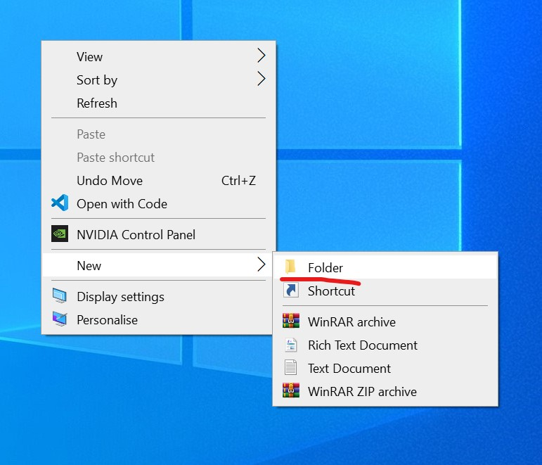
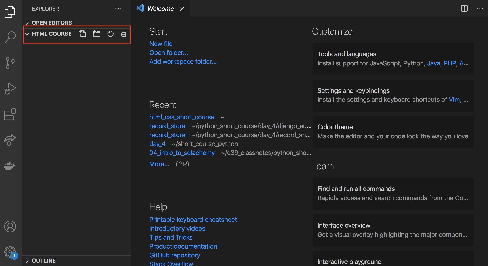
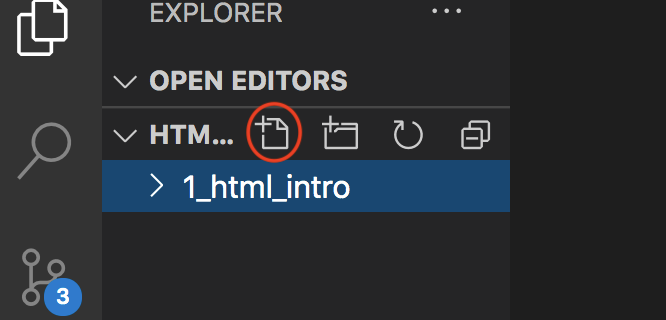
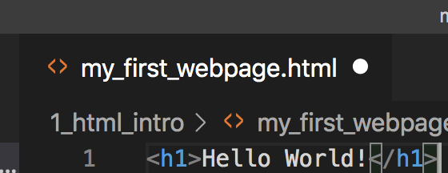
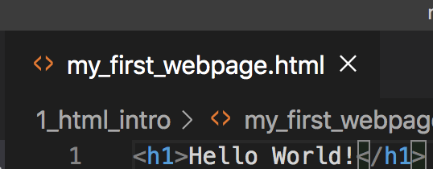
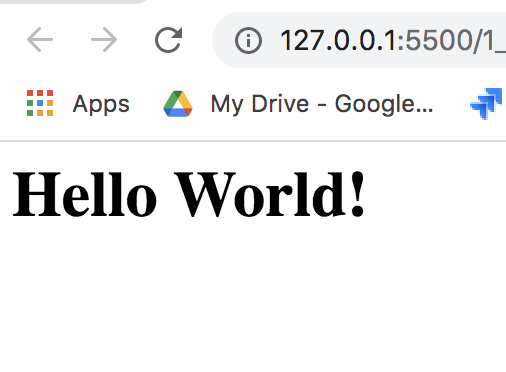

# HTML and CSS course

> Note: Before getting started make sure VS Code and Chrome is downloaded and installed, and Chrome is the default browser for Windows. You can change it manually in the Default apps section, and set Web browser to be Google Chrome.

## Who is this course for?

The course is created for people with an interest in creating, modifying or working with static websites.

## What is HTML and CSS?

Basically every website on the internet is built using 2 main technologies - HTML and CSS.

HTML stands for HyperText Markup Language - markup languages use tags and annotations in a document that helps process the text and contents of a document for display. Semantic HTML will help you create the content of your website.

CSS stands for Cascading Style Sheets - it's a style sheet language that helps with the layout and presentation of a given document. It is cascading because the different elements will get their styling from their parent elements - like a waterfall cascading down. More on this later!

Think about a book when you're visualizing HTML and CSS. HTML is the contents of the book - the text you are reading. But without CSS, it would look a giant wall of text in one big blob. When you apply CSS, however, it will suddenly organise your text into paragraphs, different font sizes for chapter headings, the page number is neatly placed at the bottom of the page. HTML is the content - CSS is the layout and styling applied to it.


## My first webpage

The first program or website people usually build is a "Hello World!" site! The reason for it is fairly simple - the first ever computer program written displayed the message "Hello world!" on the screen, and ever since then, it's tradition for beginners to start in the same fashion! Although HTML is *not* a programming language, it is still a good idea to get something quickly up and running, and we have to start with something. Let's go with Hello World then!

First, let's create a folder designated for our coursework - this can either be on our desktop, in our Documents folder or anywhere else where we can find it comfortably! I recommend the desktop to keep it simple and accessible!

On Windows, right click -> New -> Folder



Let's name it `HTML_and_CSS_course`!

You might be wondering why are we using underscore instead of spaces!

For now, it might not make a difference, but computers tend to have a hard time understanind whitespaces in file and foldernames once they are not used by a user, but by the machine itself. Think about web addresses, or URLs! THey never have whitespaces in them. 

To avoid this problem, we will use underscores in filenames and foldernames.

### Text editors

Before we start working on our website, we have to think about what are we going to use to build it. This is a much more important step than you think! Finding the right tool for the job is very important. We could use Notepad for this task - We can build perfectly function websites with just Notepad if we wanted to, but this is not what Notepad was created for.

Think about it: We can probably hammer in a nail with the flat end of a wrench, or screw in a screw with the end of a butterknife - but there are better suited tools for the job!

You might already know Microsoft Word or Google Docs - but those are word processors (basically used to format text), not text editors.

Our chosen text editor is going to be VS Code. This was originally developed by Microsoft - creators of Windows, Microsoft Word, Excel, and many more. It is one of the most popular tools on the market - and it's completely free to use!

If we didn't already, let's download it:

[Get VS Code from here](https://code.visualstudio.com/Download)

Once we downloaded and installed it, we can open it up. It's worth keeping a shortcut on the desktop or in the taskbar.

Once we've opened up VS Code, we will be greeted nby a lot of options - it might be overwhelming, but don't worry, it will make sense soon!

Let's click on File -> Open Folder, and find the folder we just created, then click `Open`.

We will be greeted by the following screen:


 
The highlighted area has a couple of options for us, we will use the first 2 mostly.

The first icon let's us create a new file, the second is for new folders.

You can also right click in the area under the icons, and then select `New Folder`.

Let's create a new folder called `1_html_intro`! Be mindful of the underscore - it pays off well if you get used to using it instead of whitespaces to separate file or foldernames.

Let's click on the foldername `1_html_intro` (make sure it is clicked on, it should have blue highlighting) and then click on the create file icon:



This will create the file under the folder which is highlighted. Give it the name `my_first_webpage.html`. The extension `.html` is very important - without it the web browsers would not understand that it can be opened up as a website.

Let's double click on the file and create our first HTML tag, with the text `Hello World!` in it:

In `my_first_webpage.html` enter the following:

```html
<h1>Hello World</h1>
```

After entering it, we can navigate back to the folder on the desktop, go to `1_html_intro`, and then either right click on the file `my_first_webpage.html` -> Open/Open with -> Chrome, or if it has the Chrome icon, we can just double click on it.

However we might not see anything on the screen! Why not?

If we go back to VS Code, we might be able to see what's wrong. Let's take a look at the tab that says `my_first_webpage.html`. If it has a dot next to the file's name, it means that we have unsaved changes in this file. We could save it by clicking on File -> Save, but it takes time to do that every time we change something.

This is the part where we like to be as lazy as possible! We do not want to spend time with boring stuff. We want to spend all our time working on the exciting parts! If you are going to save a file, let's say, 40 times an hour (at least!), and it takes you 3-4 seconds each time, you lost 4 minutes an hour doing a boring, repetitive thing.

Here is our first lesson in efficiency - start using the shortcuts that are given to us. To save your file, you can press `ctrl + S` on Windows machines, which should turn your dot into an X.

Before: 



After: 



This means our file is saved. We can now go back to our browser window, refresh the page and the changes should apply, and we should see Hello World appear on the screen!



Always save your files - it will not reflect the changes on your website if you forget it.

> Note: you can also use `ctrl + R` in the browser to refresh the page!

**Task: Change the text, save it, and refresh the browser to see the changes take place.**

You might feel like that reloading the browser every time is becoming time consuming - and you're right about that! Luckily, web developers thought the same - and created a tool that lets us refresh the browser every time we save our html file automaticall!

On the left side of VS Code's screen, let's click on the four stacked sqaures:


This is where we can find extensions for our text editor. This can help us by installing extras in our text editor to make our job much easier! Let's type in `Live Server` in the search bar, and click on install.

Once it's installed we can right click on our html file -> Open with Live server. This will open up our html file, but every time we save the file, it will refresh the browser window, so it will show us the changes we just made. There should also be a `Go Live` button in the bottom right corner, which you can click on after you selected your HTML file - clicking on it will do the same as right click -> Open with Live Server.

**Task: make some more changes to the text. Save the file, and check the browser to see it refreshed by itself!** 

Congratulations - You just created your first webpage, and you also learned how to be more efficient about it - so we can focus on the fun parts!
