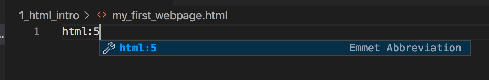
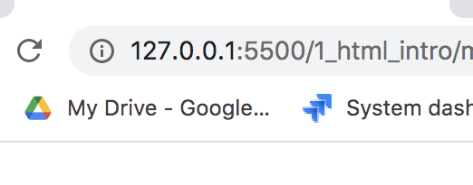

# HTML basics

Before we can start working on making our website beautiful, there are some steps we have to take and rules to follow!

It is useful to build our HTML first, before we touch the styling of our application - just like how we should build the walls, foundation and roof of our house first before we continue with painting the walls or making the garden beautiful!

## HTML template

Before we start with our webpage, we need to create something called an HTML template, skeleton, or boilerplate. This gives everything we need in order to create an HTML webpage that our browser can easily understand!

>You can show the students what they would need to manually enter on the screen first, or you can jump to asking them to create it using the `html:5` autocomplete.

We can continue working on the `my_first_webpage.html` file from the previous lesson.

This is what we would need to enter manually:

```html
<!DOCTYPE html>
<html lang="en">
<head>
    <meta charset="UTF-8">
    <meta name="viewport" content="width=device-width, initial-scale=1.0">
    <title>Document</title>
</head>
<body>
    
</body>
</html>
``` 

Luckily, we can be lazy again! Instead of us typing it all in, VS Code lets us use a shortcut. Let's type in `html:5`, and the following should be seen:



If we hit the `tab` or `enter` key on the keyboard, it will autocomplete it for us, and create the whole template without typing it all!

>Note: if the students accidentally click somewhere or make a mistake, just ask them to delete and re-enter `5`, and then the autocomplete should appear again. This can be used for any autocomplete feature, just delete the last character entered, enter it again, then you can hit `tab` or `enter` to autocomplete.

We do not need to know what every single tag here is doing, we just need to know that it's needed for websites to work well!

The 3 most important things:

- If we want to set things up for our website, add css files and others, we need to put it between the `<head></head>` tags
- Whatever is between the `<title></title>` tags will the text on the tab at the top of the browser - change it to see it take effect!
- Everything we want to show in the browser window must go between the `<body></body>` tags!

Most of the HTML tags will have an opening tag, and a closing tag, with a `/` (backslash) icon. Anything we want to show on our page or use, should go between these tags. There are some exceptions that do not need closing tags - we will talk about them when we get there.

Now that we know all these, let's start working on it! First, let's change the content of the `<title></title>` tags from `Document` to `My Awesome Website!`. Save the file, open it up with Live Server, and check out the tab in Chrome!



Then we can start working on a proper webpage!

### Header

The more we work on a website, the more HTML tags we use, and the harder it will be to work with them. It's super important to make sure we use the correct names for them, otherwise it becomes confusing for us. 

A website usually builds up from 3 main parts: 

- The `<header>`, which usually has a logo, navigation bar, links and maybe a search bar.
- The `<main>`, which will include the main content for our webpage.
- And the `<footer>`, where we can put another set of links for navigation, terms and conditions, and other miscellaneous stuff.

Let's create these HTML tags!
>Note: Autocomplete for these are `header`/`main`/`footer` + tab/enter

```html
<!--as before-->

<body>
    <header>

    </header>
    <main>

    </main>
    <footer>
        
    </footer>
</body>

<!--as before-->
```

It helps us if we try to imagine our website's elements like a tree, branching out!


Each new branch should start a little to the right inside its 'parent' branch. It's called indentation, and indenting our code nicely will help us not getting lost in our html code!

The first part we need to do is creating the header, which will have a nice logo, and some navigation elements!


```html
<!--as before-->

<body>
    <header>
		<h1>&#128062; WildLife Project</h1>
    </header>

<!--as before-->
</body>

```
>Note: Autocomplete is `h1` + tab/enter

The `&#128062;` is a special character identifier, that gives us the paw symbol in our logo. There are many more symbols to use - you can google them all if you'd like!

`<h1></h1>` tags are usually used for the title of our website or for our logo - this should be big, bold, and easy to see! Luckily, this tag gives us some nice bold highlighting, and it will make the text bigger too!
 
```html
    <header>
		<h1>&#128062; WildLife Project</h1>
		<nav>
		
		</nav>
    </header>
```
>Note: Autocomplete is `nav` + tab/enter

The `<nav></nav>` tag is used for holding elements that will be used for navigating on a website, or for links that are pointing at other websites. These navigation links will be placed here as a list of links - so we should use a list element.

Lists in HTML are built up of 2 different parts

- The list itself, that can be either ordered (`<ol>`) or unordered (`<ul>`) lists. The only difference between them is that ordered list will have numbers by default, while unordered lists will have a dot at the beginning of the items.
- The list items (`<li>`) which is the same for both ordered and unordered lists.

```html
    <header>
        <h1>&#128062; WildLife Project</h1>
        <nav>
            <ul>
                <li>

                </li>
                <li>

                </li>
                <li>

                </li>
                <li>
                    
                </li>
            </ul>
        </nav>
    </header>
```

>Note: Autocomplete is `ul`/`li` + tab/enter

If we save and then check out the website, we can see that there are 4 dots, where the 4 navigation elements will go soon!

To navigate, we use links - you use them all the time when you are on other websites, and they are usually coloured blue, and have some underlining. To create one for yourself, we can do that using the anchor tag (`<a href=""></a>`).


```html
	<nav>
		<ul>
		  <li>
				<a href="">Home</a>
          </li>
          <li>
          	<a href="https://www.scottishspca.org/">SSPCA Website</a>
          </li>
          <li>
          	<a href="">Videos</a>
          </li>
          <li>
          	<a href="">About the project</a>
          </li>
       </ul>
   </nav>
```
>Note: Autocomplete is `a` + tab/enter

This is one of our first special HTML tags - special because they have something called an attribute. the `href` attribute is telling an anchor tag where it should point to. It can point to something on our own website, or it can link to another webpage, like the SSPCA home page! If it is pointing somwhere else, we need to give it the full address where it can be found! Once you saved it, try clicking on it!

Make sure you put the text between the anchor tags - if you don't put anything there, it will not show the links for you to click on!

The other anchor tags will point to other parts of our website, once we finished building it.

And this is pretty much it! We have the contents of a nice header, which will look much nicer once we add some CSS to it later!

Now onto the main section!

### Main

The main section will include all the videos captured by us, broken down into smaller sections for everyones videos, with a short description text!

```html
<!--as before-->
    <main>
        <section>
        
        </section>
    </main>
<!--as before-->
```
>Note: Autocomplete is `section` + tab/enter

The `section` tag can be used for tags we want to group together if they are related - like a video, its title, ande description.

```html
<!--as before-->
    <main>
        <section>
            <h2>Muppets - Bohemian Rhapsody</h2>
        </section>
    </main>
    
<!--as before-->

```
>Note: Autocomplete is `h2` + tab/enter

We will use an `<h2>` tag for the video title - the reason for this is that `<h1>` tags are unique, as in we should only have one of them per webpage. However, we can have more than one h2 tags, as long as they are not subtitles of each other! If you need to use a subtitle for an `<h2>`, use an `<h3>`!

```html
<!--as before-->
    <main>
        <section>
            <h2>Muppets - Bohemian Rhapsody</h2>
            <p>This video is pretty fun!</p>
        </section>
    </main>
    
<!--as before-->
```
>Note: Autocomplete is `p` + tab/enter

If we want to add one or more paragraphs to our webpage, we should use paragraph tags. Make sure every text has some tags around it! If you want to target text, or just can't come up with mroe appropriate tags, use a `<p>` tag!

It is also important because this is the only way we can format text into multiple paragraphs! If you hit enter in the middle of the line, it will not separate your text into 2 paragraphs - you need to wrap them in 2 different `<p>` tags!

Example:

```html
<p>This is some normal text

But this won't appear on a different line, 
because it's still inside a single p tag! </p>

<p>If you want to split them up into multiple lines</p>
<p>You have to it like this!</p>
```

Finally, the video! We are going to need to add a special tag for this, called `iframe`! `Iframes` are used in cases when we want to add content from a different page, directly copied into our own page - like a YouTube video! You can just copy it out if you go to any video you want from YouTube, select Share -> Embed, and copy-paste the code into our page!

```html
<!--as before-->
    <main>
        <section>
            <h2>Muppets - Bohemian Rhapsody</h2>
            <p>This video is pretty fun!</p>
            <iframe width="420" height="315" src="https://www.youtube.com/embed/tgbNymZ7vqY"></iframe>            
        </section>
    </main>
    
<!--as before-->

```

We need to give it size as well as attributes - without a height and a width, it will not show on our page! And also, we need to set what is the source of the video, which is just a link to the video itself!

If you want to add more videos, you can copy and paste the entire section, change the title, description, and the video's src attribute, and you can add as many as you want with this!

### Footer

Finally, we will need a footer for our website!

```html
<!--as before-->
    </main>
    <footer>

    </footer>
</body>
</html>

```
>Note: Autocomplete is `footer` + tab/enter

Footers are usually kept at the bottom of parent element - We can have many footers on a page, for example a Facebook or Instagram post keeps all the likes and comments in a footer section of a post in the HTML!

Let's add something simple for our site:

```html
<!--as before-->
    </main>
    <footer>
        <p>All rights reserved! SSPCA 2021</p>
    </footer>
</body>
</html>

```

And with this, we have finished the skeleton of our amazing website! Next time, we are going to make sure that it also looks great - by adding CSS to it!